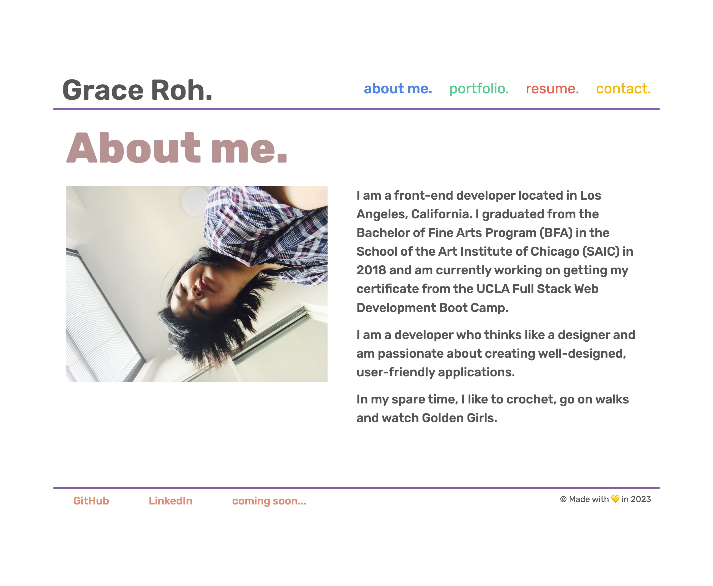
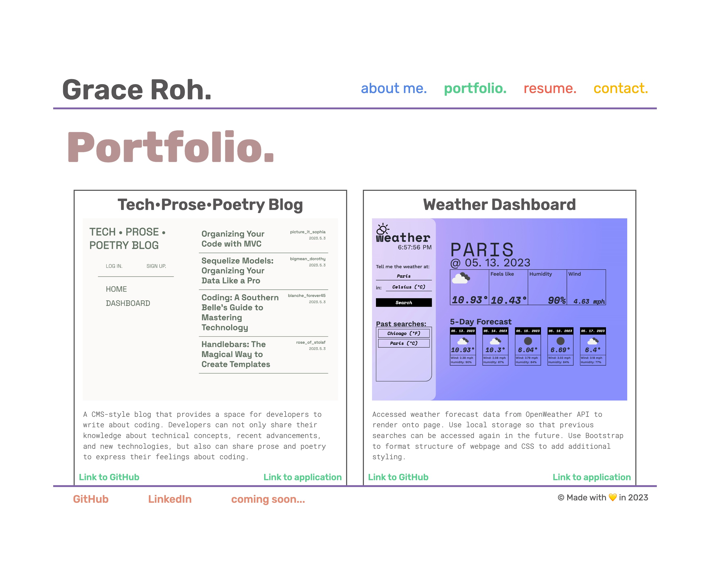
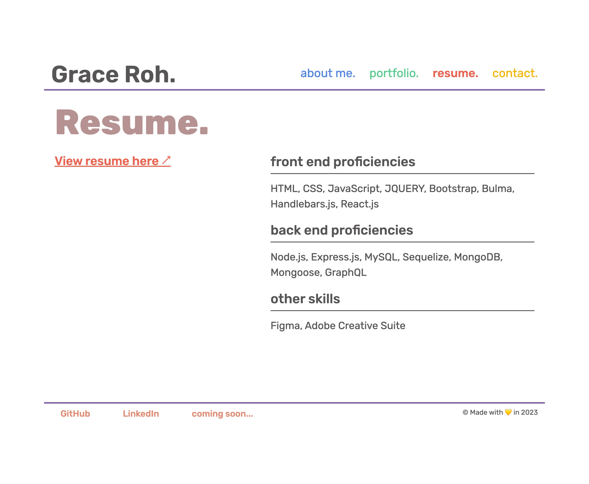
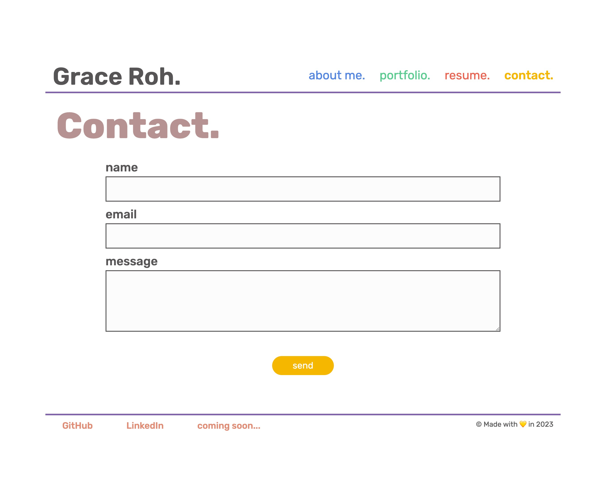

# Grace Roh - Portfolio

## Description

This is a professional website for a professional web developer. This portfolio can be used when applying for jobs or when sharing work with other developers. This portfolio was created using React.js.

## Installation

N/A

## Usage

Users can click on the navigation links to learn more about Grace Roh, her projects, and her proficiencies. Users can also click on the contact me to reach Grace Roh. In the footer, there are links to the developer's GitHub, LinkedIn, and Stack Overflow profiles.

> Link to deployed application:

### Screenshot of the About Me page

### Screenshot of the Portfolio page

### Screenshot of the Resume page

### Screenshot of the Contact page

## Credits

## License

This repository is licensed under the [MIT License](https://opensource.org/licenses/MIT).